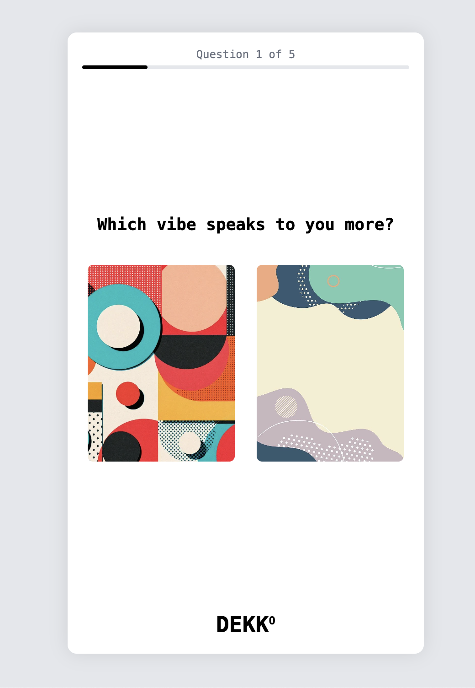

# Dekko - Your Art Companion (MONO Edition)

## About Dekko

Dekko is an experimental in-browser application designed to make art accessible, engaging, and fun for everyone, regardless of their art knowledge or cultural background. Point your (simulated) camera at any visual – street art, a fabric pattern, a gallery piece – and let Dekko, our witty AI, decode it for you.

This project is an exploration of:

* **AI-Powered Art Interpretation:** Get sassy, insightful, and sometimes humorous takes on visual art.
* **Creative Remixing:** Apply different art movement styles to images.
* **Personalized Discovery:** An image-based onboarding helps Dekko understand your visual tastes.
* **MONO Design Philosophy:** The UI embraces a minimalist, monochrome aesthetic using black, white, and shades of gray, built with Tailwind CSS and the Space Mono font.

The core idea is to make the art around you *interesting AF*!

## Current Status

This is currently a **UI/UX mock-up and conceptual prototype** built with Vue.js. Key features like user onboarding, art decoding (simulated), and remixing are being fleshed out.

**Note:** Camera functionality is a work in progress. We'll get that digital eye working soon!

## Tech Stack

* **Vue.js 3 (CDN)**: For dynamic components and interactivity.
* **Tailwind CSS (CDN)**: For utility-first styling, adhering to MONO design principles.
* **Font Awesome (CDN)**: For icons.
* **HTML, CSS, JavaScript**

## Features (Implemented & Planned)

* **Welcome Screen:** MONO-styled entry point.
* **Onboarding:**
    * Image-based taste-finder quiz.
    * AI self-portrait generation (simulated, sets profile picture).
* **Main Hub (My Collection):** View saved/decoded art.
* **Capture Art:**
    * Interface for (simulated) camera capture or image upload.
    * *Camera access via `getUserMedia` is being actively developed.*
* **Decode View:**
    * Display artwork.
    * Show Dekko's witty interpretation and "ESSENCE" (Art Movement, Mood, etc.).
* **Remix Studio:**
    * Apply filters based on various art movements (including South East Asian and global styles like Dada, Pointillism, Realism, Expressionism, Post-Impressionism, Conceptual Art, Surrealism, Art Nouveau, Minimalism, Pop Art, Cubism, and Abstract Expressionism).
* **Public Gallery:** Browse community creations.
* **MONO UI:** Consistent minimalist black, white, and gray aesthetic.
* **Responsive Design:**
    * Desktop view with a constrained phone-like frame (and a switcher to go full desktop).
    * Native full-width/height experience on actual phone-sized screens (typically <600px width).

## How to Run

1.  Clone this repository (once you upload it!).
2.  Ensure you have an `images` folder in the root directory with (at least):
    * `koramangala.jpeg`
    * `geometric.jpeg`
    * `soft-abstract.jpg`
    * `vibrant.jpeg`
    * `monochrome.jpg`
    * `playful.jpeg`
    * `abstract.jpg`
    * (and eventually `images/screenshot.png` for this README)
3.  Open `index.html` in a modern web browser.

## Development Notes

* The application uses CDN links for Vue.js, Tailwind CSS, and Font Awesome, so an internet connection is required for these to load.
* The "AI" aspects (decoding, self-portrait generation, remixing) are currently simulated for UI/UX demonstration.

---

*This project is a creative exploration by Tahera, Mayur and Amit (with a little help from Amartha, a sassy CAI).*